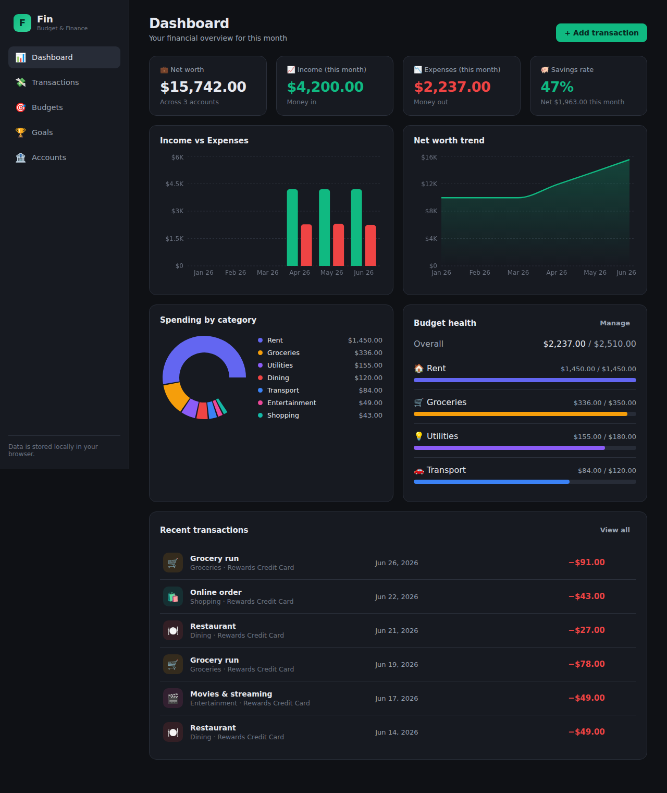

# Fin — Budget & Finance Management Dashboard

A clean, modern personal finance dashboard for tracking income, expenses,
budgets, savings goals, and net worth. Built as a fast, self-contained
single-page app that runs entirely in your browser — no backend, no signup,
no data leaves your device.



## Features

- **Dashboard** — net worth, monthly income/expenses, savings rate, an
  income-vs-expenses bar chart, a net-worth trend chart, a spending-by-category
  breakdown, budget health, and recent activity at a glance.
- **Transactions** — add, edit, and delete income, expenses, and transfers
  between accounts. Filter by type, search notes/categories, and browse grouped
  by month.
- **Budgets** — set a monthly limit per category and track spending against it
  with progress bars and over-budget warnings. Navigate between months.
- **Savings goals** — create goals with targets and target dates, watch the
  progress rings fill, and log contributions.
- **Accounts** — manage multiple accounts (checking, savings, credit, cash,
  investment) with live computed balances.
- **Categories** — fully customizable categories with colors and icons.
- **Your data, local** — everything persists to `localStorage`. Export a JSON
  backup, load sample data, or clear everything anytime.

## Tech stack

- [React 18](https://react.dev/) + [TypeScript](https://www.typescriptlang.org/)
- [Vite](https://vitejs.dev/) for dev/build tooling
- [React Router](https://reactrouter.com/) for navigation
- [Recharts](https://recharts.org/) for charts
- React Context + `useReducer` for state, persisted to `localStorage`

No external services or API keys required.

## Getting started

```bash
npm install      # install dependencies
npm run dev      # start the dev server (http://localhost:5173)
```

Other scripts:

```bash
npm run build    # type-check and build for production (outputs to dist/)
npm run preview  # preview the production build locally
npm run lint     # type-check only
```

The app ships with a realistic sample dataset on first run so the dashboard
looks alive immediately. Use **Accounts → Data → Clear all data** to start from
scratch.

## Project structure

```
src/
  components/        Reusable UI (Sidebar, Modal, transaction row & modal)
  pages/             Dashboard, Transactions, Budgets, Goals, Accounts
  store/
    FinanceContext   Global state, reducer, localStorage persistence
    selectors        Derived data (balances, monthly summaries, budget progress)
  data/seed.ts       Sample starter dataset
  utils/             Currency/date formatting helpers
  types.ts           Domain models (Account, Transaction, Budget, Goal, ...)
```

## Roadmap ideas

This frontend is structured so it can grow into a full platform. Natural next
steps: a backend API + database for multi-device sync, authentication,
recurring transactions, CSV/bank import, multi-currency support, and reporting
exports.
